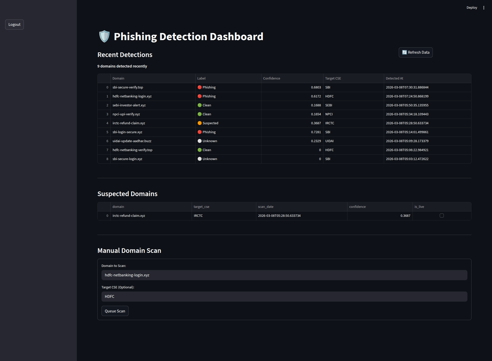
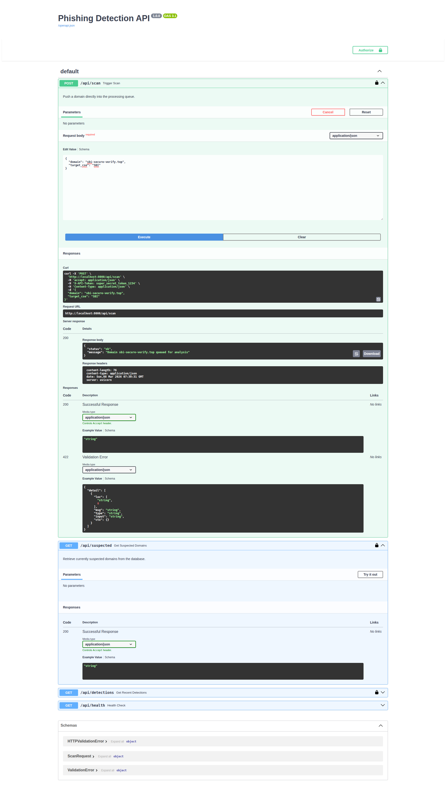

# HERALD (Formerly Matrix) — AI-Powered Phishing Domain Detection for Critical Infrastructure

> **97.7% precision on live external data. Zero third-party threat intel APIs. Fully on-premises.**

HERALD is an open-source, AI/ML platform that continuously monitors the internet for phishing and typosquatting domains targeting Critical Sector Entities (CSEs) — banks, government portals, financial institutions. It discovers threats autonomously, the moment domains are registered, without waiting for manual URL submission.

---

## Why HERALD?

Commercial threat intelligence platforms cost tens of thousands of dollars annually and often rely on external APIs that create data sovereignty concerns. Small banks, fintech companies, and government agencies in developing markets need protection too.

HERALD is:
- **Fully self-hosted** — your domain watchlist never leaves your infrastructure
- **API-free** — no VirusTotal, no Shodan, no commercial feeds
- **Real-time** — catches phishing domains within minutes of registration via Certificate Transparency logs
- **Production-validated** — 97.7% precision, 84.0% recall on live PhishTank data (March 2026)

---

## How It Works

```
Certificate Transparency Logs ──┐
Newly Registered Domain Feeds ──┤
Social Media / Telegram ────────┼──▶ Ingestion Layer ──▶ ML Ensemble (v3) ──▶ OCR Fallback ──▶ Alert
DNS / WHOIS Feeds ──────────────┤                              │
Tunnelling Services (Ngrok etc) ┘                     Suspected Domain
                                                       Re-monitor Queue
                                                       (configurable, default 90 days)
```

### Detection Pipeline

1. **Real-time Discovery** — Certstream WebSocket monitors Certificate Transparency logs. Newly registered domain feeds polled every hour. Social media scraped for shared phishing links.

2. **ML Ensemble (v3)** — XGBoost + Random Forest ensemble on 30+ engineered features including lexical ratios, fuzzy brand matching, TLD risk scoring, and path keyword detection.

3. **OCR Visual Fallback** — Borderline predictions trigger a headless browser screenshot + visual similarity analysis against known CSE templates. Catches phishing pages with no URL similarity to the target brand.

4. **Enrichment** — Every detected domain automatically enriched with WHOIS, IP geolocation, ASN, MX records, SSL certificate info, registrar details, and a screenshot.

5. **Suspected Domain Monitoring** — Parked domains with no content are queued for re-monitoring over a configurable window (default 90 days) and escalated if they activate.

---

## Performance

| Dataset | Precision | Recall | F1 |
|---|---|---|---|
| Internal test set (n=186) | 0.912 | 0.890 | 0.901 |
| **External — PhishTank live (n=71)** | **0.977** | **0.840** | **0.900** |
| CSE legitimate domain protection | 0.952 specificity | — | — |

External validation run on March 7, 2026 on completely unseen PhishTank data filtered for Indian financial/government sector.

---

## Screenshots

### Dashboard — Live Detections


### API — Swagger Docs  


---

## Features

### Detection Capabilities
- **Typosquatting** — edit distance, keyboard adjacency, character substitution
- **IDN / Homoglyph** — Unicode confusable character detection (Cyrillic, Greek substitutions)
- **Fuzzy brand matching** — Levenshtein distance catches `5bi`, `hdfc1`, `uldai` variants
- **Path-based phishing** — detects brand keywords buried in URL paths on generic domains
- **TLD risk scoring** — explicit penalty for high-risk gTLDs (`.xyz`, `.top`, `.buzz`, `.tk` etc.)
- **Tunnelling service detection** — flags Ngrok, Vercel, Cloudflare Tunnel subdomains serving lookalike content
- **Visual similarity** — OCR + perceptual hashing against CSE page templates

### Data Sources
- Certificate Transparency logs (Certstream WebSocket + crt.sh fallback)
- Newly registered domain feeds
- Passive DNS
- Social media / Telegram public channels
- Direct URL submission via API

### Per-Domain Reports
Every detected domain generates a report with:
- Domain creation date/time
- Registrar + registrant details
- IP, ASN, hosting country
- MX and DNS records
- SSL/TLS certificate info
- Full-page screenshot (PDF evidence)
- Maliciousness confidence score

---

## Quick Start

```bash
# Clone
git clone https://github.com/Black-Coffee-Ramen/HERALD
cd HERALD

# Start everything (recommended)
docker compose up --build

# Dashboard: http://localhost:8501
# API docs:  http://localhost:8000/docs
```

Requires Docker with 8GB+ RAM allocated.

### Manual Setup

```bash
python3.12 -m venv venv
source venv/bin/activate
pip install -r requirements.txt

# Install ChromeDriver (for screenshot capture)
sudo apt update && sudo apt install -y chromium-chromedriver
# webdriver-manager is also included in requirements as fallback

# Train model on your dataset
python train_model.py --training_data data/training/

# Run detection on a domain list
python run_detection.py --cse_file your_cse_list.csv --output_dir results/

# Launch dashboard
streamlit run app/dashboard.py
```

---

## Configuration

```yaml
# config.yaml
monitoring:
  suspected_duration_days: 90     # Re-monitor parked domains for this long
  check_interval_hours: 24        # How often to re-scan suspected domains

classification:
  phishing_threshold: 0.571       # Tuned for precision/recall balance (v3)
  suspected_threshold: 0.35       # Below this = legitimate

crawler:
  max_threads: 50
  screenshot_timeout: 30

whitelist:
  domains:
    - accounts.mgovcloud.in       # Add legitimate domains to avoid FPs
```

---

## Project Structure

```
herald/                          # Main package
├── __init__.py                  # v0.1.0
├── core/                        # ML ensemble, OCR analyzer, content classifier
│   ├── content_classifier.py
│   ├── domain_analyzer.py
│   ├── cv_ocr_analyzer.py
│   └── homoglyph_generator.py
├── features/                    # Lexical, WHOIS, SSL, DNS feature extractors
├── ingestion/                   # Certstream, domain feeds, Telegram scraper
│   ├── certstream_monitor.py
│   ├── new_domains_monitor.py
│   ├── social_monitor.py
│   └── tunnel_monitor.py
├── monitoring/                  # APScheduler for suspected domain re-checks
│   └── run_workers.py
├── api/                         # FastAPI REST layer
│   └── main.py
├── db/                          # SQLAlchemy models (PostgreSQL)
│   └── models.py
├── predict.py                   # Batch prediction
├── predict_with_fallback.py     # ML + OCR fallback predictor
└── utils/                       # Screenshot, PDF, logging helpers
ml/                              # Model training & retraining scripts
dashboard/                       # Streamlit dashboard
docker/                          # Dockerfile + docker-compose.yml
models/                          # Trained ensemble_v3.joblib
scripts/                         # Error analysis, ablation, evaluation
tests/                           # Test stubs
config.yaml
setup.py
requirements.txt
.env.example
.gitignore
```

---

## Architecture

```
┌─────────────────────────────────────────────────────┐
│                   Docker Network                     │
│                                                      │
│  ┌──────────┐   ┌──────────┐   ┌─────────────────┐  │
│  │Streamlit │   │ FastAPI  │   │    Workers       │  │
│  │Dashboard │◀──│   API    │◀──│ Certstream       │  │
│  │ :8501    │   │  :8000   │   │ Domain Poller    │  │
│  └──────────┘   └────┬─────┘   │ Scheduler        │  │
│                      │         └────────┬────────┘  │
│              ┌───────▼──────┐           │            │
│              │  PostgreSQL  │◀──────────┘            │
│              │   + Redis    │                        │
│              └──────────────┘                        │
└─────────────────────────────────────────────────────┘
```

**Services:**
- `dashboard` — Streamlit UI with live alerts and CSE↔phishing mapping
- `api` — FastAPI REST endpoints (`/api/scan`, `/api/suspected`, `/api/report/{domain}`)
- `workers` — Certstream monitor + domain poller + suspected domain scheduler
- `postgres` — Domain history, scan records, enrichment data
- `redis` — Job queue for async scanning

---

## API Reference

```bash
# Submit a domain for immediate scanning
POST /api/scan
{"domain": "sbi-login-secure.xyz"}

# Get all currently monitored suspected domains
GET /api/suspected

# Get full enrichment report for a domain
GET /api/report/sbi-login-secure.xyz

# Health check
GET /api/health
```

Full interactive docs at `http://localhost:8000/docs` when running.

---

## Adding Your Own CSE Watchlist

Edit `herald/features/lexical_features.py`:

```python
CSE_KEYWORDS = [
    "sbi", "hdfc", "icici", "pnb", "uidai", "irctc",
    "npci", "sebi", "incometax", "epfo",
    # Add your brands here
    "yourbank", "yourbrand",
]
```

Then retrain:
```bash
python ml/retrain_v3.py --training_data data/training/
```

To add Telegram channels to monitor, edit `config.yaml`:
```yaml
social:
  telegram_channels:
    - your_channel_name    # public channel username (no @)
  scrape_interval_minutes: 30
  max_posts_per_scrape: 50
```

---

## Deployment Requirements

| Component | Minimum | Recommended |
|---|---|---|
| OS | Ubuntu 22.04 LTS | Ubuntu 24.04 LTS |
| CPU | 8 cores | 16+ cores |
| RAM | 8 GB | 32 GB |
| Storage | 50 GB | 200 GB |
| Docker RAM | 8 GB | 16 GB |

For large-scale monitoring (50+ CSEs, real-time CT log processing), 48+ cores and 256GB RAM allows parallel scanning of thousands of domains per hour.

---

## What's Not Included

HERALD deliberately avoids:
- VirusTotal, Shodan, or any commercial threat intel API
- Any external phishing detection service
- Cloud-only dependencies

All intelligence is generated locally from public data sources.

---

## Roadmap

- [ ] React dashboard (replace Streamlit for production deployments)
- [ ] STIX/TAXII export for sharing indicators
- [ ] Webhook alerts (Slack, email, PagerDuty)
- [ ] Multi-tenant support for monitoring multiple organizations
- [ ] BERT-based domain name similarity model

---

## Contributing

PRs welcome. Key areas where contributions help most:

- Additional CSE keyword lists for other countries/sectors
- New data source integrations (more CT log providers, DNS feeds)
- Dashboard improvements
- Model retraining on larger datasets

Please open an issue before starting large changes.

---

## License

MIT License — use freely, attribution appreciated.

---

## Declared External Dependencies

All external network calls made by HERALD:

- `python-whois` — WHOIS lookups via public WHOIS servers
- `Selenium` + local ChromeDriver — headless browser for screenshot capture
- `certstream` — WebSocket to `wss://certstream.calidog.io` (CT logs)
- `crt.sh` — Fallback HTTP polling for certificate transparency data
- `requests` + `BeautifulSoup` — Telegram public web scraping (`t.me/s/channel`)
- Public DNS resolution via Python `socket` / `aiodns`

**No commercial threat intelligence APIs. No VirusTotal, Shodan, or external phishing detection services.**

---

## Contact

Built by Athiyo — IIIT Delhi  
athiyo22118@iiitd.ac.in

---


*Precision 0.977 on live PhishTank data · Zero third-party APIs · Fully on-premises*
