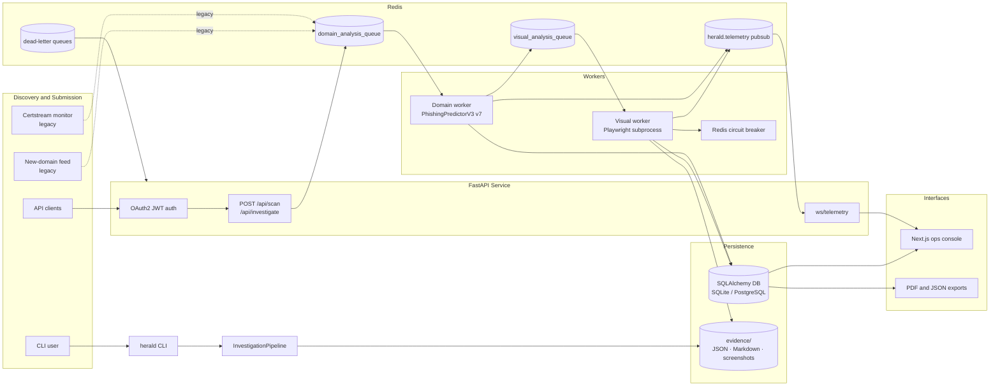
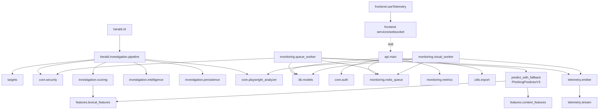
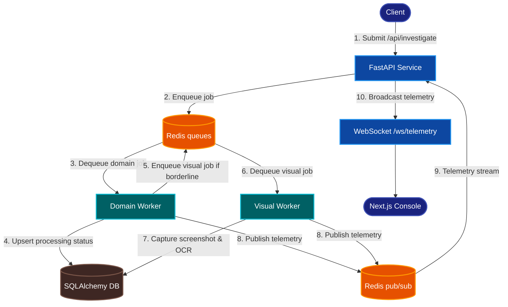
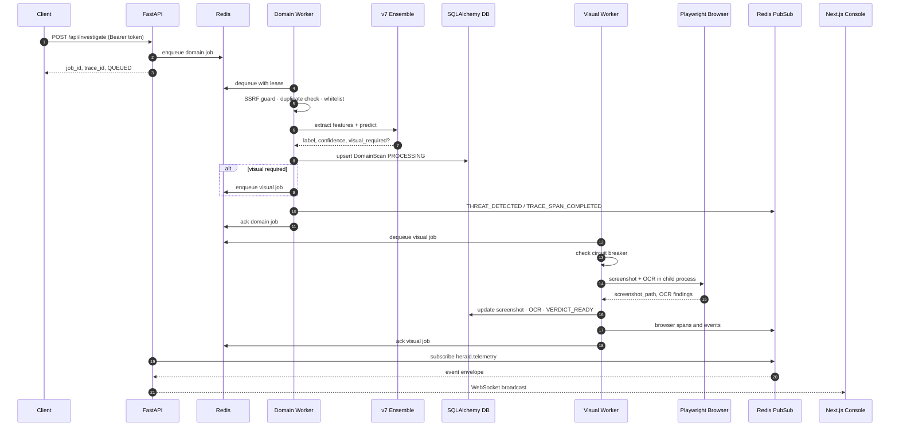
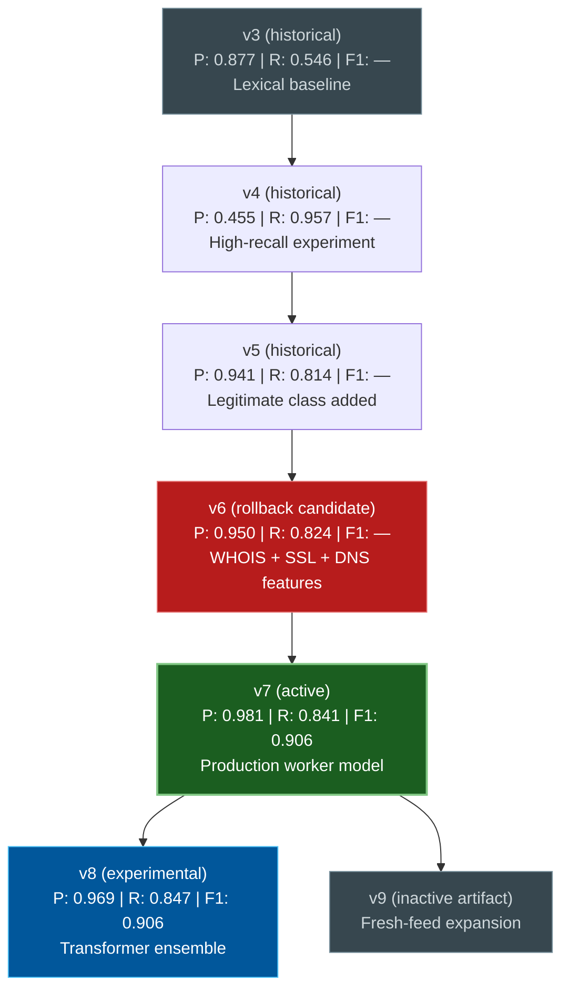

<div align="center">


# HERALD (Heuristic & Ensemble Risk Assessment for Lookalike Domains)

### Phishing Domain Intelligence Platform

> Self-hosted · Evidence-driven · Zero third-party APIs · 0.981 precision on live PhishTank data

<br>


<br><br>

[](https://www.python.org/downloads/)
[](https://fastapi.tiangolo.com)
[](https://nextjs.org)
[](LICENSE)
[](#performance-metrics)

</div>

---

HERALD is an open-source phishing investigation platform that monitors the internet for lookalike domains targeting banks, government portals, and financial institutions. It catches threats within minutes of domain registration by combining Certificate Transparency log monitoring, multi-stage ML detection, live network enrichment, and Playwright-powered visual analysis, all without relying on VirusTotal, Shodan, or any paid threat intelligence feed.

Unlike classifiers that output only a binary label, HERALD produces **investigation artifacts**: structured JSON, Markdown reports, full-page screenshots, and explainable risk factor breakdowns.

> **Operational status:** The **CLI investigation workflow** is the most reliable and battle-tested path today. The API, Redis worker queue, and Next.js dashboard are operational but under active stabilization.

---

## Contents

- [Overview](#overview)
- [Architecture](#architecture)
- [Detection Pipeline](#detection-pipeline)
- [Investigation Lifecycle](#investigation-lifecycle)
- [Performance Metrics](#performance-metrics)
- [Quick Start](#quick-start)
- [Installation](#installation)
- [CLI Reference](#cli-reference)
- [Platform Mode](#platform-mode)
- [API Reference](#api-reference)
- [Environment Variables](#environment-variables)
- [Deployment](#deployment)
- [ML Model Lineage](#ml-model-lineage)
- [Configuration](#configuration)
- [Repository Structure](#repository-structure)
- [Screenshots](#screenshots)
- [Security Considerations](#security-considerations)
- [Known Limitations](#known-limitations)
- [Contributing](#contributing)
- [Roadmap](#roadmap)
- [Contact](#contact)

---

## Overview

HERALD addresses a specific operational gap: organizations that cannot rely on commercial threat-intelligence APIs need a local, self-hosted path to discover and investigate suspicious domains, particularly domains impersonating Indian banking, government, telecom, and public-service brands (SBI, HDFC, ICICI, IRCTC, UIDAI, NIC, Airtel, IOCL, and others).

Commercial platforms cost tens of thousands of dollars annually and create data sovereignty concerns. Small banks, fintech companies, and government agencies in developing markets need the same level of protection.

HERALD is:

- **Self-hosted** — your domain watchlist and scan data never leave your infrastructure
- **API-free** — no VirusTotal, Shodan, or commercial feeds required
- **Real-time** — catches phishing domains within minutes of CT log registration
- **Explainable** — every verdict comes with a human-readable risk factor breakdown
- **Resilient** — individual stage failures (DNS, TLS, OCR) degrade gracefully without aborting an investigation

The system solves two distinct sub-problems. **High-volume early discovery**: new certificate-transparency events and NRD feeds arrive continuously; most domains are benign. A fast ML-first triage pass handles this cheaply. **High-confidence investigation**: shortlisted suspicious domains need explainable evidence: lexical risk, DNS/WHOIS/TLS metadata, screenshots, OCR-detected credential prompts, and analyst-reviewable reports. HERALD handles this through a dedicated investigation pipeline.

The current codebase has three active product surfaces:

| Surface | Entry point | Description |
|---|---|---|
| CLI investigation | `herald investigate <url>` | Direct, evidence-first pipeline; no Redis/DB dependency |
| Platform API | `docker compose up` | FastAPI + Redis workers + SQLAlchemy + Next.js ops console |
| Research/training | `scripts/` | Dataset construction, feature extraction, model training |

---

## Architecture

HERALD has three operational layers:

```
┌─────────────────────────────────────────────────────────────────┐
│  CLI-first investigation path  (primary, reliable today)        │
│                                                                  │
│  herald CLI → InvestigationPipeline                             │
│    → SSRF validation → Lexical → DNS/WHOIS → TLS →             │
│      Playwright/OCR → Score fusion → Evidence persistence       │
└─────────────────────────────────────────────────────────────────┘
┌─────────────────────────────────────────────────────────────────┐
│  API / Redis worker path  (partially active, stabilizing)       │
│                                                                  │
│  FastAPI → Redis queues → Domain worker (PhishingPredictorV3)  │
│    → SQLAlchemy DB                                              │
│    → Visual worker (Playwright subprocess)                      │
│    → Redis pub/sub telemetry → WebSocket /ws/telemetry          │
└─────────────────────────────────────────────────────────────────┘
┌─────────────────────────────────────────────────────────────────┐
│  Next.js operations console  (mock-first, real hooks present)   │
│                                                                  │
│  Dashboard → TelemetryClient (MOCK default)                     │
│    → REAL/HYBRID: WebSocket to FastAPI backend                  │
└─────────────────────────────────────────────────────────────────┘
```

### System Architecture Diagram


```mermaid
flowchart LR
  subgraph Sources[Discovery and Submission]
    APIClient[API clients]
    CLIUser[CLI user]
    CT[Certstream monitor\nlegacy]
    NRD[New-domain feed\nlegacy]
  end

  subgraph API[FastAPI Service]
    Auth[OAuth2 JWT auth]
    Scan[POST /api/scan\n/api/investigate]
    WS[ws/telemetry]
  end

  subgraph Queue[Redis]
    DQ[(domain_analysis_queue)]
    VQ[(visual_analysis_queue)]
    PubSub[(herald.telemetry pubsub)]
    DLQ[(dead-letter queues)]
  end

  subgraph Workers[Workers]
    DomainWorker[Domain worker\nPhishingPredictorV3 v7]
    VisualWorker[Visual worker\nPlaywright subprocess]
    Circuit[Redis circuit breaker]
  end

  subgraph Persistence[Persistence]
    DB[(SQLAlchemy DB\nSQLite / PostgreSQL)]
    Evidence[(evidence/\nJSON · Markdown · screenshots)]
  end

  subgraph UI[Interfaces]
    Next[Next.js ops console]
    Reports[PDF and JSON exports]
  end

  CLIUser --> CLI[herald CLI]
  CLI --> Direct[InvestigationPipeline]
  Direct --> Evidence

  APIClient --> Auth --> Scan --> DQ
  CT -. legacy .-> DQ
  NRD -. legacy .-> DQ

  DQ --> DomainWorker --> DB
  DomainWorker --> VQ
  VQ --> VisualWorker --> DB
  VisualWorker --> Evidence
  VisualWorker --> Circuit

  DomainWorker --> PubSub
  VisualWorker --> PubSub
  PubSub --> WS --> Next
  DB --> Reports
  DB --> Next
  DLQ --> API
```

### Module Dependency Graph


```mermaid
flowchart TD
  CLI[herald.cli] --> Pipeline[herald.investigation.pipeline]
  Pipeline --> Targets[targets]
  Pipeline --> Sec[core.security]
  Pipeline --> Score[investigation.scoring]
  Pipeline --> Intel[investigation.intelligence]
  Pipeline --> Persist[investigation.persistence]
  Pipeline --> Playwright[core.playwright_analyzer]
  Score --> Lex[features.lexical_features]

  API[api.main] --> DB[db.models]
  API --> Auth[core.auth]
  API --> RQ[monitoring.redis_queue]
  API --> Metrics[monitoring.metrics]
  API --> Export[utils.export]

  QW[monitoring.queue_worker] --> RQ
  QW --> DB
  QW --> Predictor[predict_with_fallback\nPhishingPredictorV3]
  QW --> Telemetry[telemetry.emitter]
  QW --> Sec
  Predictor --> Lex
  Predictor --> Content[features.content_features]

  VW[monitoring.visual_worker] --> RQ
  VW --> DB
  VW --> Playwright
  VW --> Telemetry
  Telemetry --> Stream[telemetry.stream]

  Next[frontend useTelemetry] --> WS[frontend services/websocket]
  WS -. real .-> API
```

### API / Worker Data Flow


```mermaid
flowchart TD
  classDef client fill:#1a237e,stroke:#3f51b5,stroke-width:2px,color:#fff;
  classDef api fill:#0d47a1,stroke:#2196f3,stroke-width:2px,color:#fff;
  classDef queue fill:#e65100,stroke:#ff9800,stroke-width:2px,color:#fff;
  classDef worker fill:#006064,stroke:#00bcd4,stroke-width:2px,color:#fff;
  classDef db fill:#3e2723,stroke:#795548,stroke-width:2px,color:#fff;

  Client([Client]):::client -->|1. Submit /api/investigate| API[FastAPI Service]:::api
  API -->|2. Enqueue job| RedisQueue[(Redis queues)]:::queue
  RedisQueue -->|3. Dequeue domain job| DW[Domain Worker]:::worker
  DW -->|4. Upsert processing status| DB[(SQLAlchemy DB)]:::db
  DW -->|5. Enqueue visual job if borderline| RedisQueue
  RedisQueue -->|6. Dequeue visual job| VW[Visual Worker]:::worker
  VW -->|7. Capture screenshot & OCR| DB
  DW -->|8. Publish telemetry| PubSub[(Redis pub/sub)]:::queue
  VW -->|8. Publish telemetry| PubSub
  PubSub -->|9. Telemetry stream| API
  API -->|10. Broadcast telemetry| WS[WebSocket /ws/telemetry]:::api
  WS --> UI([Next.js Console]):::client
```

---

## Detection Pipeline

HERALD uses a **three-stage detection architecture** that progressively applies more expensive analysis only when cheaper stages are inconclusive.

### Stage 1 — Lexical Intelligence

Fast domain-name analysis runs on every submitted domain. It covers typosquatting distance to CSE brand keywords, keyboard adjacency patterns, homoglyph and Unicode confusable character detection (Cyrillic, Greek), entropy and character ratio analysis, subdomain depth and registered-domain length, suspicious gTLD and punycode flags, and login/auth/verify/secure/banking keyword presence.

Explicit scoring penalties apply for high-risk gTLDs (`.xyz`, `.top`, `.buzz`, `.tk`) and tunnelling services such as Ngrok, Vercel, and Cloudflare Tunnel subdomains.

### Stage 2 — Network & Content Enrichment

Borderline scores (confidence in `[0.35, 0.65]`) trigger live enrichment:

- WHOIS metadata and domain age
- DNS A/MX/TXT records and TTL
- SSL certificate inspection — issuer, SAN match, age, Let's Encrypt flag
- HTTP content fetch: forms, password fields, external actions, obfuscated JS, and iframes
- Screenshot capture and OCR extraction via Playwright + Tesseract

The lexical score, domain age, TLS anomalies, and OCR findings combine into an additive verdict capped at 1.0.

### Stage 3 — Continuous Monitoring

Suspicious parked domains are re-scanned periodically (configurable, default 90 days), tracked for content activation, and auto-escalated when a change is detected.

---

## Investigation Lifecycle


```mermaid
sequenceDiagram
  autonumber
  participant Client
  participant API as FastAPI
  participant Redis
  participant DW as Domain Worker
  participant Model as v7 Ensemble
  participant DB as SQLAlchemy DB
  participant VW as Visual Worker
  participant Browser as Playwright Browser
  participant Telemetry as Redis PubSub
  participant UI as Next.js Console

  Client->>API: POST /api/investigate (Bearer token)
  API->>Redis: enqueue domain job
  API-->>Client: job_id, trace_id, QUEUED
  DW->>Redis: dequeue with lease
  DW->>DW: SSRF guard · duplicate check · whitelist
  DW->>Model: extract features + predict
  Model-->>DW: label, confidence, visual_required?
  DW->>DB: upsert DomainScan PROCESSING
  alt visual required
    DW->>Redis: enqueue visual job
  end
  DW->>Telemetry: THREAT_DETECTED / TRACE_SPAN_COMPLETED
  DW->>Redis: ack domain job
  VW->>Redis: dequeue visual job
  VW->>VW: check circuit breaker
  VW->>Browser: screenshot + OCR in child process
  Browser-->>VW: screenshot_path, OCR findings
  VW->>DB: update screenshot · OCR · VERDICT_READY
  VW->>Telemetry: browser spans and events
  VW->>Redis: ack visual job
  API->>Telemetry: subscribe herald.telemetry
  Telemetry-->>API: event envelope
  API-->>UI: WebSocket broadcast
```

### CLI Investigation Steps

For direct CLI use, `InvestigationPipeline` runs the same logic synchronously without Redis or a database:

1. **SSRF Validation** — blocks loopback, RFC1918, and cloud-metadata endpoints
2. **Lexical Analysis** — heuristic score from `features.lexical_features`
3. **DNS & WHOIS Intelligence** — A/MX/TXT records, registrar, domain age
4. **TLS Inspection** — port 443 certificate, SAN coverage, issuer
5. **Screenshot & OCR** — Playwright headless capture, Tesseract extraction
6. **Score Fusion** — weighted combination → `Phishing` / `Suspected` / `Likely Clean`
7. **Evidence Persistence** — `investigation.json`, `report.md`, `evidence/trc-*/`

---

## Performance Metrics

| Dataset | Precision | Recall | F1 Score |
|---|---:|---:|---:|
| Indian CSE Filtered Dataset | 0.981 | 0.841 | 0.906 |
| PhishTank Validation | 1.000 | 1.000 | 1.000 |
| Legitimate Domain Validation | 1.000 | 1.000 | 1.000 |

> External validation run on March 10, 2026 on PhishTank data filtered for the Indian financial and government sector.

---

## Quick Start

The fastest path to a working investigation and no server or database required:

```bash
git clone https://github.com/Black-Coffee-Ramen/HERALD
cd HERALD
python -m venv .venv && source .venv/bin/activate
pip install -r requirements-dev.txt
pip install -e .
python -m playwright install chromium
herald investigate paypal-login-alert.com
```

Example output:

```text
HERALD Investigation

Verdict: Suspicious
Score: 0.82
Trace: trc-8837ebe50d

Risk Factors:
  · Brand impersonation detected
  · Login credential phrases identified
  · Suspicious lexical patterns
  · Newly registered infrastructure
  · OCR detected credential prompts

Evidence written to: evidence/trc-8837ebe50d_paypal-login-alert.com/
  · investigation.json
  · report.md
  · screenshot.png
```

---

## Installation

### Prerequisites

* Python 3.12+
* Node.js 18+ (Frontend only)
* Tesseract OCR (required for OCR text extraction)
* PostgreSQL development libraries (`libpq-dev`)
* Playwright browser dependencies

---

### Python Environment

Create and activate a virtual environment:

```bash
python3 -m venv .venv
source .venv/bin/activate       # Linux/macOS
# .venv\Scripts\activate        # Windows
```

Upgrade pip:

```bash
pip install --upgrade pip
```

Install Python dependencies:

```bash
pip install -r requirements-runtime.txt
```

Install HERALD:

```bash
pip install -e .
```

Install Playwright browsers:

```bash
playwright install
```

Verify installation:

```bash
herald --help
```

Expected commands:

```text
investigate
analyze
screenshot
report
```

---

### System Dependencies

#### Ubuntu / Debian

```bash
sudo apt update
sudo apt install tesseract-ocr libpq-dev
```

#### macOS

```bash
brew install tesseract
```

Tesseract enables OCR extraction from captured screenshots. Without it, screenshot capture still works but OCR extraction is skipped.

---

### Frontend (Optional)

```bash
cd frontend
npm install
npm run dev
```

Frontend available at:

```text
http://localhost:3000
```

The frontend defaults to mock/synthetic telemetry. Set:

```bash
NEXT_PUBLIC_TELEMETRY_MODE=REAL
```

and run the API backend to connect live investigation data.

---

### Docker

Build and start the platform:

```bash
docker compose up --build
```

---

### Troubleshooting

#### `Command 'herald' not found`

Make sure HERALD itself is installed:

```bash
pip install -e .
```

#### `ModuleNotFoundError: No module named 'rich'`

Install Rich:

```bash
pip install rich
```

If this occurs, add `rich` to `requirements-runtime.txt` and reinstall dependencies.

#### Playwright Browser Errors

Reinstall browser binaries:

```bash
playwright install
```

#### Verify Installation

```bash
which herald
pip show herald
herald --help
```


### Frontend (Optional)

```bash
cd frontend
npm install
npm run dev
# Available at http://localhost:3000
```

The frontend defaults to mock/synthetic telemetry. Set `NEXT_PUBLIC_TELEMETRY_MODE=REAL` and run the API backend to connect live data.

### Docker

Build and start the platform:

```bash
docker compose up --build
```

---

## CLI Reference

The `herald` console script is installed by `setup.py` as `herald = herald.cli:main`.

### `herald investigate`

Runs the full investigation pipeline: SSRF validation → lexical analysis → DNS/WHOIS → TLS → screenshot/OCR → score fusion → evidence persistence.

```bash
herald investigate <target> [--json] [--no-visual] [--allow-private]
```

```bash
# Standard investigation with Rich terminal output
herald investigate paypal-login-alert.com

# JSON output for scripting and automation
herald investigate https://example.com/login --json

# Skip Playwright and OCR (faster, no browser required)
herald investigate suspicious.example --no-visual

# Permit private/internal IP resolution (metadata endpoints remain blocked)
herald investigate internal.test --allow-private
```

Output includes trace ID, verdict, phishing score, evidence path, risk factor explanations, DNS/TLS intelligence, and pipeline stage lifecycle.

**Verdict thresholds:**

| Verdict | Score |
|---|---|
| `Phishing` | ≥ 0.70 |
| `Suspected` | ≥ 0.35 |
| `Likely Clean` | < 0.35 |

### `herald analyze`

Runs the investigation pipeline without Playwright screenshot or OCR. Faster and suitable for bulk analysis.

```bash
herald analyze <domain> [--json] [--allow-private]
```

### `herald screenshot`

Runs the investigation with visual analysis and prints only the visual evidence summary.

```bash
herald screenshot <target> [--json] [--allow-private]
```

Screenshot saved to: `evidence/<trace_id>_<domain>/screenshots/homepage.png`

### `herald report`

Loads a previously persisted investigation by trace ID.

```bash
herald report <trace_id> [--json]
```

Trace IDs follow the format `trc-<10 hex chars>`. Lookup scans `evidence/<trace_id>*/investigation.json`.

### Exit Codes

| Code | Meaning |
|---|---|
| `0` | Completed successfully |
| `1` | Report not found or no command given |
| `2` | SSRF protection blocked the target |

### Evidence Layout

```
evidence/
  investigations.jsonl                          ← index of all runs
  trc-1a2b3c4d5e_paypal-login-alert.com/
    investigation.json                          ← complete structured result
    report.md                                   ← human-readable Markdown report
    screenshots/
      homepage.png                              ← full-page screenshot
```

Top-level JSON fields: `trace_id`, `input`, `url`, `domain`, `started_at`, `completed_at`, `elapsed_ms`, `verdict`, `phishing_score`, `evidence_dir`, `lexical`, `dns`, `tls`, `visual`, `summary`, `risk_factors`, `stages`, `errors`.

---

## Platform Mode

The platform mode adds a Redis-backed worker pipeline, REST API, and Next.js ops console.

```bash
# Start all services (Redis, API, domain worker, visual worker)
docker compose up --build

# Initialize the database
python setup_db.py

# Start the Next.js frontend separately
cd frontend && npm run dev
```

Set `NEXT_PUBLIC_TELEMETRY_MODE=REAL` to connect the frontend to live backend WebSocket telemetry (default is `MOCK`).

Services started by `docker-compose.yml`:

| Service | Role |
|---|---|
| `redis` | Queue broker · pub/sub · circuit state |
| `api` | FastAPI REST + WebSocket on `:8000` |
| `worker` | Domain scoring worker |
| `visual-worker` | Screenshot/OCR worker (Playwright subprocess) |

---

## API Reference

The FastAPI application runs at `http://localhost:8000`. Interactive Swagger docs are available at `/docs`.

> **Note:** The API is functional but less battle-tested than the CLI. Queue submission endpoints have a known globals issue, see [Known Limitations](#known-limitations).

### Authentication

```bash
# Register a local user
POST /api/auth/register
{"username": "analyst", "password": "secret"}

# Obtain a bearer token (OAuth2 password form)
POST /api/auth/token
# Form fields: username, password
# Returns: {"access_token": "...", "token_type": "bearer"}
```

### Public Endpoints

| Method | Path | Description |
|---|---|---|
| `GET` | `/` | Service metadata |
| `GET` | `/api/health` | Liveness probe |
| `GET` | `/api/ready` | Database, Redis, and telemetry readiness |
| `GET` | `/metrics` | In-process Prometheus-style metrics |
| `GET` | `/api/metrics-summary` | Queue depths, worker state, circuit breaker status |
| `WS` | `/ws/telemetry` | Redis pub/sub → WebSocket bridge |

### Queue Submission (Authenticated)

```bash
# Enqueue a domain for background analysis
POST /api/scan
Authorization: Bearer <token>
{"domain": "sbi-login-secure.xyz", "target_cse": "Unknown"}

# Enqueue a URL — normalizes to domain, returns job and trace IDs
POST /api/investigate
Authorization: Bearer <token>
{"url": "https://sbi-login-secure.xyz/login"}
```

### Data Retrieval (Authenticated)

| Method | Path | Description |
|---|---|---|
| `GET` | `/api/suspected` | List `DomainScan` rows with `Suspected` verdict |
| `GET` | `/api/detections` | 50 most recent `DomainScan` rows |
| `GET` | `/api/export/{domain}/json` | Full JSON export for a domain |
| `GET` | `/api/export/{domain}/pdf` | PDF evidence report for a domain |

### Analyst Tools (Authenticated)

| Method | Path | Description |
|---|---|---|
| `POST` | `/api/feedback` | Submit analyst verdict override |
| `GET` | `/api/whitelist` | List whitelisted domains |
| `POST` | `/api/whitelist` | Add a domain to the whitelist |
| `DELETE` | `/api/whitelist/{domain}` | Remove a domain from the whitelist |
| `GET` | `/api/admin/failed-jobs` | View dead-letter queue entries |
| `POST` | `/api/admin/failed-jobs/retry` | Drain DLQ back to the ready queue |

---

## Environment Variables

Copy `.env.example` to `.env` and configure before running.

### Database and Cache

| Variable | Default | Description |
|---|---|---|
| `DATABASE_URL` | `sqlite:///domain_history.db` | SQLAlchemy database URL |
| `REDIS_HOST` | `localhost` | Redis hostname |
| `REDIS_PORT` | `6379` | Redis port |

### API Authentication

| Variable | Description |
|---|---|
| `JWT_SECRET_KEY` | Secret key for JWT signing — **must be changed in production** |
| `JWT_ALGORITHM` | Algorithm for JWT (e.g. `HS256`) |
| `ACCESS_TOKEN_EXPIRE_MINUTES` | Token lifetime in minutes |

### Queue Tuning

| Variable | Description |
|---|---|
| `DOMAIN_QUEUE_MAX_READY` | Queue-pressure threshold before API backpressure |
| `VISUAL_QUEUE_MAX_READY` | Domain worker threshold for enqueuing visual jobs |
| `VISUAL_ANALYSIS_TIMEOUT_SECONDS` | Visual worker child-process timeout |
| `VISUAL_CIRCUIT_FAILURE_THRESHOLD` | Failures before circuit opens |
| `VISUAL_CIRCUIT_RESET_SECONDS` | Seconds before circuit half-opens |

### Browser

| Variable | Description |
|---|---|
| `PLAYWRIGHT_PAGE_LOAD_TIMEOUT` | Page navigation timeout in milliseconds |
| `EVIDENCE_DIR` | Default output directory for visual analysis |

### Frontend

| Variable | Default | Description |
|---|---|---|
| `NEXT_PUBLIC_TELEMETRY_MODE` | `MOCK` | `MOCK`, `REAL`, or `HYBRID` |
| `NEXT_PUBLIC_WS_URL` | `ws://localhost:8000/ws/telemetry` | WebSocket backend URL |
| `NEXT_PUBLIC_API_URL` | `http://localhost:8000` | REST backend URL |

---

## Deployment

### Recommended: CLI-only (no infrastructure dependencies)

```bash
pip install -r requirements-runtime.txt
pip install -e .
python -m playwright install chromium
herald investigate example.com
```

Evidence writes to `evidence/` locally. No Redis or database required.

### API + Worker Stack

Requires Redis. SQLite is the default; set `DATABASE_URL` for PostgreSQL.

```bash
# API server
uvicorn herald.api.main:app --host 0.0.0.0 --port 8000

# Domain analysis worker
python -m herald.monitoring.queue_worker

# Visual analysis worker (isolated subprocess for browser/OCR timeouts)
python -m herald.monitoring.visual_worker
```

### Hardware Requirements

| Component | Minimum | Recommended |
|---|---|---|
| OS | Ubuntu 22.04 LTS | Ubuntu 24.04 LTS |
| CPU | 8 cores | 16+ cores |
| RAM | 8 GB | 32 GB |
| Storage | 50 GB | 200 GB |

For large-scale monitoring of 50+ CSEs with real-time CT log processing, 48+ cores and 256 GB RAM support parallel scanning of thousands of domains per hour.

---

## ML Model Lineage

HERALD has two independent detection paths:

**CLI path** (`herald/investigation/scoring.py`): Rule-based heuristic scoring fast, fully explainable, no model file required.

**Worker path** (`herald/predict_with_fallback.py`): `PhishingPredictorV3` loads `models/ensemble_v7.joblib` a Random Forest (40%) + XGBoost (60%) ensemble with content-feature adjustment for borderline scores.

### Version History


```mermaid
flowchart TD
  classDef active fill:#1b5e20,stroke:#81c784,stroke-width:2px,color:#fff;
  classDef historical fill:#37474f,stroke:#78909c,stroke-width:1px,color:#cfd8dc;
  classDef experimental fill:#01579b,stroke:#4fc3f7,stroke-width:1px,color:#fff;
  classDef rollback fill:#b71c1c,stroke:#e57373,stroke-width:1px,color:#fff;
  
  v3["v3 (historical)<br/>P: 0.877 | R: 0.546 | F1: —<br/>Lexical baseline"]:::historical --> v4["v4 (historical)<br/>P: 0.455 | R: 0.957 | F1: —<br/>High-recall experiment"]
  v4 --> v5["v5 (historical)<br/>P: 0.941 | R: 0.814 | F1: —<br/>Legitimate class added"]
  v5 --> v6["v6 (rollback candidate)<br/>P: 0.950 | R: 0.824 | F1: —<br/>WHOIS + SSL + DNS features"]:::rollback
  v6 --> v7["v7 (active)<br/>P: 0.981 | R: 0.841 | F1: 0.906<br/>Production worker model"]:::active
  v7 --> v8["v8 (experimental)<br/>P: 0.969 | R: 0.847 | F1: 0.906<br/>Transformer ensemble"]:::experimental
  v7 --> v9["v9 (inactive artifact)<br/>Fresh-feed expansion"]:::historical
```

| Version | Precision | Recall | F1 | Status | Notes |
|---|---:|---:|---:|---|---|
| v3 | 0.877 | 0.546 | — | historical | Lexical baseline |
| v4 | 0.455 | 0.957 | — | historical | High-recall experiment |
| v5 | 0.941 | 0.814 | — | historical | Legitimate class added |
| v6 | 0.950 | 0.824 | — | rollback candidate | WHOIS + SSL + DNS features |
| **v7** | **0.981** | **0.841** | **0.906** | **active** | **Production worker model** |
| v8 | 0.969 | 0.847 | 0.906 | experimental | Transformer ensemble |
| v9 | — | — | — | inactive artifact | Fresh-feed expansion |

### Feature Count by Version

| Model | Feature count | Threshold |
|---|---:|---:|
| v5 | 33 | 0.60 |
| v6 | 48 | 0.45 |
| v7 | 39 | 0.65 |
| v8 | 44 | 0.55 |

The `models/` directory contains artifacts from v2 through v9. The production worker defaults to `ensemble_v7.joblib`; all others are historical or experimental. Override with the `MODEL_PATH` environment variable to evaluate v8/v9.

### Research Finding

> Through extensive experimentation across multiple model generations, HERALD demonstrates that **pure lexical phishing detection reaches a practical performance ceiling around F1 ≈ 0.91**. Beyond this threshold, live content inspection and visual intelligence become necessary not optional. This is the core architectural motivation for v7's two-stage inference design.

---

## Configuration

```yaml
# config.yaml
monitoring:
  suspected_duration_days: 90     # Re-monitor parked domains for this long
  check_interval_hours: 24        # How often to re-scan suspected domains

classification:
  phishing_threshold: 0.571       # Tuned for precision/recall balance
  suspected_threshold: 0.35       # Below this = likely legitimate

crawler:
  max_threads: 50
  screenshot_timeout: 30

whitelist:
  domains:
    - accounts.mgovcloud.in       # Known-legitimate domains to suppress false positives
```

### Adding a CSE Watchlist

Edit `herald/features/lexical_features.py`:

```python
CSE_KEYWORDS = [
    "sbi", "hdfc", "icici", "pnb", "uidai", "irctc",
    # Add your brands here
    "yourbank", "yourbrand",
]
```

Then retrain the model:

```bash
python research/scripts/retrain_v3.py --training_data research/datasets/
```

### Adding Telegram Channels to Monitor

```yaml
# config.yaml
social:
  telegram_channels:
    - your_channel_name    # public channel username — no @ prefix
  scrape_interval_minutes: 30
  max_posts_per_scrape: 50
```

---

## Repository Structure

```text
herald/                                  # Core backend package
├── cli.py                               # Unified CLI entrypoint for investigations, reporting, screenshots, and analysis
│
├── investigation/                       # End-to-end investigation orchestration pipeline
│   ├── pipeline.py                      # InvestigationPipeline coordinating the full analysis lifecycle
│   ├── scoring.py                       # Heuristic scoring engine, confidence fusion, and verdict generation
│   ├── intelligence.py                  # DNS, WHOIS, TLS, and infrastructure intelligence collectors
│   ├── targets.py                       # URL normalization, parsing, validation, and safe-domain helpers
│   └── persistence.py                   # Evidence persistence layer for JSON, Markdown, and JSONL artifacts
│
├── core/                                # Shared security, browser, authentication, and utility primitives
│   ├── security.py                      # SSRF mitigation, IP validation, and private-range blocking
│   ├── playwright_analyzer.py           # Headless Chromium automation, OCR extraction, and screenshot capture
│   ├── auth.py                          # JWT authentication, bcrypt password hashing, and access control
│   └── homoglyph_generator.py           # Unicode homoglyph and confusable-domain generation utilities
│
├── features/                            # Feature engineering and extraction modules
│   ├── lexical_features.py              # Lexical phishing indicators and brand impersonation detection
│   ├── content_features.py              # HTTP content inspection and page-level behavioral analysis
│   └── dns_features.py                  # DNS resolution, record parsing, and infrastructure enrichment
│
├── api/                                 # FastAPI backend services and API layer
│   └── main.py                          # REST API routes, WebSocket bridge, queue submission, and orchestration
│
├── db/                                  # Database abstraction and persistence models
│   └── models.py                        # SQLAlchemy models for scans, whitelists, and historical tracking
│
├── monitoring/                          # Distributed queue processing and operational infrastructure
│   ├── redis_queue.py                   # Reliable Redis queue with retries, leasing, and dead-letter handling
│   ├── queue_worker.py                  # Domain analysis worker consuming queued scan jobs
│   ├── visual_worker.py                 # Isolated OCR/browser subprocess worker for visual inspection
│   ├── metrics.py                       # Prometheus-style runtime metrics and instrumentation
│   ├── resilience.py                    # Redis circuit breaker and fault-tolerance utilities
│   └── scheduler.py                     # Automated re-scan scheduling for suspicious domains
│
├── ingestion/                           # Real-time domain intelligence and threat ingestion services
│   ├── certstream_monitor.py            # Certificate Transparency log stream monitoring
│   ├── new_domains_monitor.py           # Newly registered domain discovery and polling pipeline
│   ├── social_monitor.py                # Telegram public-channel phishing intelligence scraper
│   └── tunnel_monitor.py                # Detection of tunneling-service generated subdomains
│
├── telemetry/                           # Redis pub/sub telemetry transport and event envelopes
│
├── predict_with_fallback.py             # ML inference pipeline with resilient fallback prediction handling
│
└── utils/                               # Shared utilities for exports, logging, and reporting
    ├── logging/                         # Structured logging helpers and runtime diagnostics
    ├── exporters/                       # JSON, CSV, and structured evidence export utilities
    └── reporting/                       # HTML/PDF report generation and formatting helpers

frontend/                                # Next.js operational dashboard and analyst console
├── app/                                 # App Router pages, layouts, and API routes
├── components/                          # Dashboard widgets, traces, DLQ views, and investigation panels
├── hooks/                               # Custom React hooks including telemetry subscriptions
├── services/                            # WebSocket clients, API adapters, and mock data generators
└── types/                               # Shared TypeScript interfaces and telemetry schemas

models/                                  # Machine learning model artifacts and serialized assets
├── ensemble_v7.joblib                   # Production ensemble model (Random Forest + XGBoost)
├── domain_transformer.pt                # Experimental transformer-based character model
└── char_vocab.json                      # Character vocabulary mapping for transformer inference

research/                                # Experimental ML pipelines, datasets, notebooks, and training scripts
legacy/                                  # Archived legacy implementations and deprecated tooling
tests/                                   # Pytest suite covering scoring, CLI flows, APIs, and security logic
docker/                                  # Containerization assets and deployment orchestration files
evidence/                                # Runtime-generated investigation evidence and forensic artifacts

requirements-runtime.txt                 # Minimal runtime dependencies for production deployments
requirements-dev.txt                     # Development, linting, formatting, and testing dependencies
requirements-research.txt                # Research and experimentation dependencies
requirements-lock.txt                    # Fully pinned dependency lock file
setup.py                                 # Python package metadata and installation configuration
config.yaml                              # Centralized runtime and infrastructure configuration
docker-compose.yml                       # Multi-service local orchestration setup
.env.example                             # Environment variable template for local setup and deployment
```

---

## Screenshots

### Research Figures

#### Two-Stage Detection Architecture


The platform pipeline: CT logs, NRD feeds, and social monitors feed into a Redis-backed ingestion layer. The queue worker applies a lexical ensemble (XGBoost + Random Forest) first. Borderline domains in the `[0.35, 0.65]` confidence range are escalated to network enrichment (WHOIS · SSL · DNS). Results persist to storage and are surfaced via FastAPI and the ops console.

#### ML Decision Flow


The inference decision tree. Scores above 0.65 exit early as **Phishing**. Scores below 0.30 exit early as **Clean**. Borderline cases enter Stage 2 fallback analysis, DNS, WHOIS, SSL, content features, and visual OCR producing an adjusted score `S'` and a final three-way verdict.

---

### Ops Console — Platform Mode

#### Main Dashboard — Live Threat Feed


The live threat feed showing real-time domain verdicts (Benign / Suspicious / Malicious), queue pressure, infrastructure state, circuit breaker statuses, and system DLQ size.

#### Observability — Infrastructure & Browser Fleet


Infrastructure observability view: API latency, worker throughput, DLQ pressure, degraded mode state, queue backlog history chart, browser fleet telemetry (active sessions, launch latency, capture latency, memory pressure), and circuit breaker states for DNS, WHOIS, Browser, ML, PostgreSQL, and Redis subsystems.

#### DLQ — Dead Letter Queue


The Dead Letter Queue view listing failed jobs requiring manual intervention, job IDs, worker assignment, failure class (ParseError / TimeoutError), browser timeout tags, and retry counts against limits.

---

### Ops Console — Domain Investigation Detail

#### High-Confidence Phishing — amazon-prime-rewards.co (93.6% CRIT)


Platform domain detail for a confirmed phishing domain. OCR extracted three high-risk credential phrases ("Sign in to your account", "Verify your identity", "Enter your password to continue") at 98.5%, 95.2%, and 92.1% confidence respectively. Infrastructure relationships show associated `login-` and `auth-` subdomains. Let's Encrypt TLS issuer, Namecheap registrar, created 2026-05-24.

#### Low-Confidence Benign — dropbox-file-access.net (10.0% OK)


Platform domain detail for a domain that scored clean. No OCR findings; processing timeline shows all stages completed (domain observed → lexical analysis → DNS enrichment → visual analysis → OCR → verdict persisted). DNS resolves to two A records and an MX pointing to the same domain. DigiCert TLS issuer, MarkMonitor registrar, creation date 1999, signals a legitimate or parked domain.

---

### CLI Investigation Examples

#### SSRF Protection — IIIT Delhi (Internal Network, Blocked)


Running `herald investigate https://iiitd.ac.in` while connected to the campus network. The domain resolves to `192.168.2.127` — a private RFC1918 address. HERALD's SSRF guard immediately blocks the target before any browser execution occurs, printing the resolved IP and reason. The `--allow-private` flag is offered as an explicit override for intentional internal analysis.

#### SSRF Override — IIIT Delhi (Internal Network, Allowed)


Running `herald investigate https://iiitd.ac.in --allow-private`. With the override flag, the investigation proceeds: lexical analysis (43ms), DNS + WHOIS intelligence (945ms), TLS inspection via Sectigo RSA CA (59ms), and screenshot + OCR (3843ms). Verdict: **Likely Clean**, score 0.1375. Registrar: ERNET India. Domain age: 6506 days. No suspicious OCR phrases found.

#### Legitimate Domain — Paytm


`herald investigate https://paytm.com` — verdict **Likely Clean**, score 0.1125. Registrar: GoDaddy. Domain age: 8372 days. TLS issuer: DigiCert / GeoTrust. No lexical keywords triggered. Screenshot captured with zero suspicious OCR phrases. Full lifecycle: SSRF validation (9ms) → lexical analysis (57ms) → DNS + WHOIS (1850ms) → TLS (162ms) → screenshot + OCR (3541ms).

#### Suspicious Domain — authena.xyz


`herald investigate https://authena.xyz` — verdict **Suspected**, score 0.4175. Two risk factors flagged: lexical keyword `auth` (medium severity, impact 0.08) and `.xyz` TLD commonly seen in abuse datasets (medium severity, impact 0.2). Registrar: Namecheap. Domain age: 336 days. TLS issuer: Google Trust Services. Screenshot captured with no OCR phrases, but lexical + TLD signals are sufficient to hold the domain as Suspected. Full lifecycle completed in under 6 seconds.

---

### API Reference

#### Swagger / OpenAPI


Full Swagger UI for the HERALD FastAPI backend, showing all registered routes.

#### API — /api/scan Execution


Live `/api/scan` execution in Swagger: POST body `{"domain": "sbi-secure-login.xyz"}`, bearer auth header, server response confirming the domain is queued for analysis. Also shows the `/api/health` liveness response with DB connection state, queue depth, and Redis status.

---

## Technology Stack

**Backend**

| Layer | Technology |
|---|---|
| CLI / entrypoint | Python 3.12, argparse via `setup.py` console script |
| Investigation pipeline | Custom `InvestigationPipeline` in `herald/investigation/` |
| API | FastAPI + Uvicorn + SlowAPI (rate limiting) |
| ML ensemble | scikit-learn Random Forest + XGBoost, joblib serialization |
| Browser automation | Playwright (headless Chromium) |
| OCR | Tesseract via pytesseract |
| Feature extraction | dnspython, python-whois, tldextract, BeautifulSoup |
| Queue / workers | Redis + `RedisReliableQueue` (leases, DLQ, retries) |
| Database | SQLAlchemy — SQLite default, PostgreSQL optional |
| Telemetry | Redis pub/sub → WebSocket bridge |
| Reports | reportlab (PDF), structlog (structured logging) |

**Frontend**

| Layer | Technology |
|---|---|
| Framework | Next.js 16 (App Router), React 19 |
| Styling | Tailwind CSS 4 |
| Charts | Recharts |
| Icons | lucide-react |
| Real-time | WebSocket client connected to `/ws/telemetry` |

---

## Security Considerations

**Strengths**

- SSRF guard blocks private RFC1918, loopback, and cloud-metadata destinations before any browser execution
- Visual worker container drops all capabilities, runs as non-root, and uses PID/tmpfs limits
- OAuth2/JWT protects all data endpoints; passwords are hashed with bcrypt
- Queue backpressure prevents resource exhaustion under high load

**Known gaps (to be addressed before any externally accessible deployment)**

| Issue | Location | Impact |
|---|---|---|
| Permissive CORS | `herald/api/main.py` | Allows all origins with credentials — must be restricted |
| Hard-coded JWT default | `JWT_SECRET_KEY` | Must be overridden via environment variable in production |
| Open user registration | `/api/auth/register` | Must be gated for any publicly accessible deployment |
| Browser SSRF gaps | `playwright_analyzer.py` | Subresource loads and post-navigation redirects are not re-validated |
| Redis persistence | `docker-compose.yml` | No named volume — persistence depends on container filesystem |
| Joblib model trust | `models/ensemble_v7.joblib` | Pickle-based artifacts; validate provenance before deploying |

---

## External Network Dependencies

HERALD makes outbound calls to the following public infrastructure only:

- `python-whois` — WHOIS lookups via public WHOIS servers
- `playwright` — Headless Chromium browsing of target domains
- `certstream` — WebSocket to `wss://certstream.calidog.io` for Certificate Transparency
- `crt.sh` — Fallback HTTP polling for CT data
- Public DNS resolution via Python `socket` / `aiodns`
- `requests` + `BeautifulSoup` — Telegram public channel scraping (`t.me/s/channel`)

No commercial threat intelligence APIs. No VirusTotal, Shodan, or external detection services.

---

## Known Limitations

The following issues are tracked and not yet resolved:

| Issue | Location | Impact |
|---|---|---|
| `requirements.txt` missing | `docker/Dockerfile` | Docker builds fail without manual fix |
| Unqualified queue globals | `herald/api/main.py` | `/api/scan` and `/api/investigate` likely raise `NameError` |
| Stale Streamlit path | `docker/docker-compose.yml` | References `dashboard/dashboard.py` (moved to `legacy/`) |
| Frontend defaults to mock | `NEXT_PUBLIC_TELEMETRY_MODE` | Dashboard shows synthetic data unless set to `REAL` |
| Split detection engines | `scoring.py` vs `predict_with_fallback.py` | CLI and worker verdicts use different logic and thresholds |
| Redis retry/DLQ bug | `redis_queue.py` | DLQ behavior is not safe to rely on in production |
| `--reload` in compose | `docker-compose.yml` | Uvicorn reload flag is not appropriate for production |
| v8/v9 not auto-adopted | `monitoring/queue_worker.py` | Require explicit `MODEL_PATH` configuration |

---

## Contributing

Contributions are welcome. Please open an issue before starting any large change to discuss scope and approach.

Areas where help is most valuable:

- **CSE keyword lists** for countries and sectors beyond India
- **New data source integrations** — additional CT log providers, passive DNS feeds
- **Fix Docker deployment** — update `docker/Dockerfile` to reference `requirements-runtime.txt`
- **Fix API queue globals** — replace unqualified `domain_queue` with explicit `get_domain_queue()` calls in `herald/api/main.py`
- **Integration tests** — `herald investigate --json` with mocked DNS/TLS/Playwright
- **Frontend wiring** — connect DLQ page, trace page, and health/readiness routes to real backend endpoints; add bearer auth to real-mode API calls
- **Model documentation** — model cards for `ensemble_v7.joblib` covering feature list, thresholds, training data lineage, and validation metrics

### Development Setup

```bash
python -m venv .venv && source .venv/bin/activate
pip install -r requirements-dev.txt
pip install -e .
python -m playwright install chromium

# Run the focused CLI test suite
python -m pytest tests/test_investigation_cli.py -q

# Verify compile-time correctness
python -m compileall herald -q
```

---

## Roadmap

- [ ] Fix `RedisReliableQueue.retry_or_dlq` and stabilize DLQ behavior
- [ ] Add Alembic migrations and PostgreSQL service to production compose
- [ ] Wire bearer auth into Next.js frontend real-mode API calls
- [ ] React dashboard replacing legacy Streamlit for production deployments *(in progress)*
- [ ] STIX/TAXII export for sharing indicators with other platforms
- [ ] Webhook alerts — Slack, email, PagerDuty
- [ ] Multi-tenant support for monitoring multiple organizations
- [ ] OpenTelemetry export and Prometheus/Grafana integration
- [ ] Redirect-chain analysis and stronger report visualization
- [ ] BERT-based domain name similarity model
- [ ] Real-time analyst feedback loops for active learning

---

## License

MIT License

---

## Contact

<div align="center">

**Athiyo Chakma**
CSE Undergraduate · IIIT Delhi
[athiyo22118@iiitd.ac.in](mailto:athiyo22118@iiitd.ac.in)

Built as a phishing investigation, threat-intelligence, and operational security tooling project focused on evidence-first analysis of domains targeting Indian critical infrastructure.

---

*0.981 precision on live PhishTank data · Zero third-party APIs · Fully on-premises*

</div>