<div align="center">


# HERALD

### Phishing Investigation & Threat Intelligence Toolkit

> Self-hosted · Evidence-driven · 97.7% precision on live external data

<br>


</div>

# HERALD
## Phishing Investigation & Threat Intelligence Toolkit

> Self-hosted · Evidence-driven · 97.7% precision on live external data

HERALD is a phishing-domain investigation platform that combines local ML-based scoring, DNS/WHOIS/TLS enrichment, browser-based evidence collection, OCR extraction, Redis-backed worker orchestration, and operational telemetry — built for analysts investigating domains that target Critical Sector Entities.

Unlike classifiers that output only a binary label, HERALD produces **investigation artifacts**: structured JSON, Markdown reports, screenshots, and explainable risk reasoning.

---

## Contents

- [Overview](#overview)
- [Architecture](#architecture)
- [Detection Pipeline](#detection-pipeline)
- [Investigation Lifecycle](#investigation-lifecycle)
- [CLI Quickstart](#cli-quickstart)
- [Platform Mode](#platform-mode)
- [ML Model Lineage](#ml-model-lineage)
- [Performance Metrics](#performance-metrics)
- [Technology Stack](#technology-stack)
- [Deployment](#deployment)
- [Screenshots](#screenshots)
- [Security Considerations](#security-considerations)
- [Current Limitations](#current-limitations)
- [Future Work](#future-work)

---

## Overview

HERALD addresses a specific operational gap: organizations that cannot rely on commercial threat-intelligence APIs need a **local, self-hosted** path to discover and investigate suspicious domains — particularly domains impersonating Indian banking, government, telecom, and public-service brands (SBI, HDFC, ICICI, IRCTC, UIDAI, NIC, Airtel, IOCL, etc.).

The system solves two distinct sub-problems:

**High-volume early discovery** — new certificate-transparency events and NRD feeds arrive continuously; most domains are benign. A fast ML-first triage pass handles this cheaply.

**High-confidence investigation** — shortlisted suspicious domains need explainable evidence: lexical risk, DNS/WHOIS/TLS metadata, screenshots, OCR-detected credential prompts, and analyst-reviewable reports. HERALD handles this through a dedicated investigation pipeline.

The current codebase has three active product surfaces:

| Surface | Entry point | Description |
|---|---|---|
| CLI investigation | `herald investigate <url>` | Direct, evidence-first pipeline; no Redis/DB dependency |
| Platform API | `docker compose up` | FastAPI + Redis workers + SQLAlchemy + Next.js ops console |
| Research/training | `scripts/` | Dataset construction, feature extraction, model training |

---

## Architecture

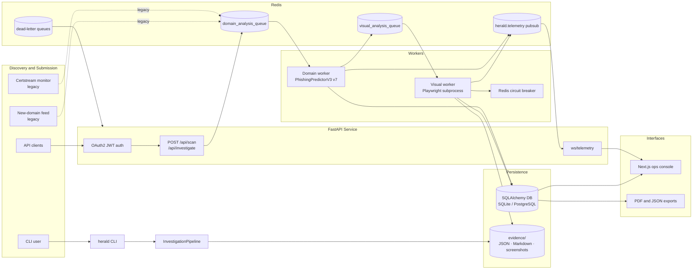
```mermaid
flowchart LR
  subgraph Sources[Discovery and Submission]
    APIClient[API clients]
    CLIUser[CLI user]
    CT[Certstream monitor\nlegacy]
    NRD[New-domain feed\nlegacy]
  end

  subgraph API[FastAPI Service]
    Auth[OAuth2 JWT auth]
    Scan[POST /api/scan\n/api/investigate]
    WS[ws/telemetry]
  end

  subgraph Queue[Redis]
    DQ[(domain_analysis_queue)]
    VQ[(visual_analysis_queue)]
    PubSub[(herald.telemetry pubsub)]
    DLQ[(dead-letter queues)]
  end

  subgraph Workers[Workers]
    DomainWorker[Domain worker\nPhishingPredictorV3 v7]
    VisualWorker[Visual worker\nPlaywright subprocess]
    Circuit[Redis circuit breaker]
  end

  subgraph Persistence[Persistence]
    DB[(SQLAlchemy DB\nSQLite / PostgreSQL)]
    Evidence[(evidence/\nJSON · Markdown · screenshots)]
  end

  subgraph UI[Interfaces]
    Next[Next.js ops console]
    Reports[PDF and JSON exports]
  end

  CLIUser --> CLI[herald CLI]
  CLI --> Direct[InvestigationPipeline]
  Direct --> Evidence

  APIClient --> Auth --> Scan --> DQ
  CT -. legacy .-> DQ
  NRD -. legacy .-> DQ

  DQ --> DomainWorker --> DB
  DomainWorker --> VQ
  VQ --> VisualWorker --> DB
  VisualWorker --> Evidence
  VisualWorker --> Circuit

  DomainWorker --> PubSub
  VisualWorker --> PubSub
  PubSub --> WS --> Next
  DB --> Reports
  DB --> Next
  DLQ --> API
```

### Module Dependency Graph

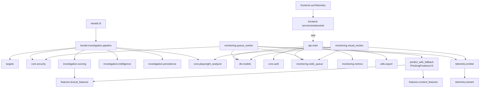
```mermaid
flowchart TD
  CLI[herald.cli] --> Pipeline[herald.investigation.pipeline]
  Pipeline --> Targets[targets]
  Pipeline --> Sec[core.security]
  Pipeline --> Score[investigation.scoring]
  Pipeline --> Intel[investigation.intelligence]
  Pipeline --> Persist[investigation.persistence]
  Pipeline --> Playwright[core.playwright_analyzer]
  Score --> Lex[features.lexical_features]

  API[api.main] --> DB[db.models]
  API --> Auth[core.auth]
  API --> RQ[monitoring.redis_queue]
  API --> Metrics[monitoring.metrics]
  API --> Export[utils.export]

  QW[monitoring.queue_worker] --> RQ
  QW --> DB
  QW --> Predictor[predict_with_fallback\nPhishingPredictorV3]
  QW --> Telemetry[telemetry.emitter]
  QW --> Sec
  Predictor --> Lex
  Predictor --> Content[features.content_features]

  VW[monitoring.visual_worker] --> RQ
  VW --> DB
  VW --> Playwright
  VW --> Telemetry
  Telemetry --> Stream[telemetry.stream]

  Next[frontend useTelemetry] --> WS[frontend services/websocket]
  WS -. real .-> API
```

---

## Detection Pipeline

HERALD uses a **three-stage detection architecture** that progressively applies more expensive analysis only when cheaper stages are inconclusive.

### Stage 1 — Lexical Intelligence

Fast domain-name analysis runs on every submitted domain:

- Typosquatting distance to CSE brand keywords
- Keyboard adjacency patterns
- Homoglyph detection
- Entropy and character ratio analysis
- Subdomain depth and registered-domain length
- Suspicious gTLD and punycode flags
- Login/auth/verify/secure/banking keyword presence

### Stage 2 — Network & Content Analysis

Borderline domains (confidence in `[0.35, 0.65]`) undergo enrichment:

- WHOIS metadata and domain age
- DNS A/MX/TXT records and TTL
- SSL certificate inspection (issuer, SAN match, age, Let's Encrypt flag)
- HTTP content fetch: forms, password fields, external actions, obfuscated JS, iframes
- Screenshot capture and OCR extraction via Playwright + Tesseract

### Stage 3 — Continuous Monitoring

Suspicious parked domains are re-scanned periodically, tracked for activation, and auto-escalated when content changes.

---

## Investigation Lifecycle

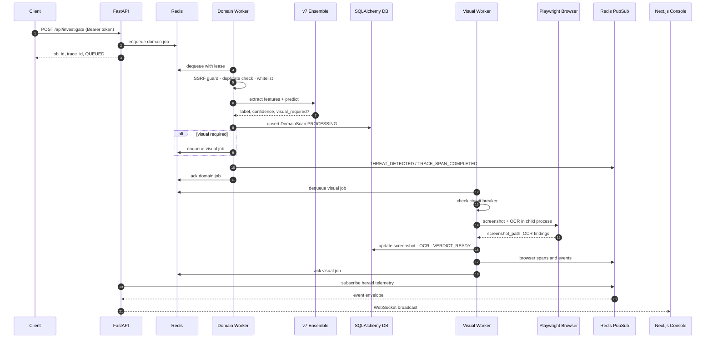
```mermaid
sequenceDiagram
  autonumber
  participant Client
  participant API as FastAPI
  participant Redis
  participant DW as Domain Worker
  participant Model as v7 Ensemble
  participant DB as SQLAlchemy DB
  participant VW as Visual Worker
  participant Browser as Playwright Browser
  participant Telemetry as Redis PubSub
  participant UI as Next.js Console

  Client->>API: POST /api/investigate (Bearer token)
  API->>Redis: enqueue domain job
  API-->>Client: job_id, trace_id, QUEUED
  DW->>Redis: dequeue with lease
  DW->>DW: SSRF guard · duplicate check · whitelist
  DW->>Model: extract features + predict
  Model-->>DW: label, confidence, visual_required?
  DW->>DB: upsert DomainScan PROCESSING
  alt visual required
    DW->>Redis: enqueue visual job
  end
  DW->>Telemetry: THREAT_DETECTED / TRACE_SPAN_COMPLETED
  DW->>Redis: ack domain job
  VW->>Redis: dequeue visual job
  VW->>VW: check circuit breaker
  VW->>Browser: screenshot + OCR in child process
  Browser-->>VW: screenshot_path, OCR findings
  VW->>DB: update screenshot · OCR · VERDICT_READY
  VW->>Telemetry: browser spans and events
  VW->>Redis: ack visual job
  API->>Telemetry: subscribe herald.telemetry
  Telemetry-->>API: event envelope
  API-->>UI: WebSocket broadcast
```

### CLI Investigation Steps

For direct CLI use, `InvestigationPipeline` runs the same logic synchronously without Redis or DB:

1. **SSRF Validation** — blocks loopback, RFC1918, and cloud-metadata endpoints
2. **Lexical Analysis** — heuristic score from `features.lexical_features`
3. **DNS & WHOIS Intelligence** — A/MX/TXT records, registrar, domain age
4. **TLS Inspection** — port 443 certificate, SAN coverage, issuer
5. **Screenshot & OCR** — Playwright headless capture, Tesseract extraction
6. **Score Fusion** — weighted combination → `Phishing` / `Suspected` / `Likely Clean`
7. **Evidence Persistence** — `investigation.json`, `report.md`, `evidence/trc-*/`

---

## CLI Quickstart

```bash
pip install -e .

# Investigate a URL (full pipeline)
herald investigate https://paypal-login-alert.com

# Analyze a domain (lexical + enrichment only)
herald analyze suspicious-domain.com

# Capture screenshot evidence
herald screenshot https://example.com

# Print a saved investigation report
herald report trc-xxxxxxxxxx

# JSON output for scripting
herald investigate https://example.com --json
```

Example output:

```text
HERALD Investigation

Verdict: Suspicious
Score: 0.82
Trace: trc-8837ebe50d

Risk Factors:
  · Brand impersonation detected
  · Login credential phrases identified
  · Suspicious lexical patterns
  · Newly registered infrastructure
  · OCR detected credential prompts

Evidence written to: evidence/trc-8837ebe50d_paypal-login-alert.com/
  · investigation.json
  · report.md
  · screenshot.png
```

---

## Platform Mode

The platform mode adds a Redis-backed worker pipeline, REST API, and Next.js ops console.

```bash
# Start all services (Redis, API, domain worker, visual worker)
docker compose up --build

# Initialize the database
python setup_db.py

# Start the Next.js frontend separately
cd frontend && npm run dev
```

Set `NEXT_PUBLIC_TELEMETRY_MODE=REAL` to connect the frontend to live backend WebSocket telemetry (default is mock).

### API Endpoints (selected)

| Method | Path | Description | Auth |
|---|---|---|---|
| POST | `/api/auth/register` | Create user | No |
| POST | `/api/auth/token` | Obtain bearer token | No |
| POST | `/api/scan` | Queue domain scan | Yes |
| POST | `/api/investigate` | Queue URL investigation | Yes |
| GET | `/api/detections` | Latest 50 scan records | Yes |
| GET | `/api/suspected` | Suspected-label records | Yes |
| POST | `/api/feedback` | Submit analyst verdict | Yes |
| GET | `/api/export/{domain}/pdf` | ReportLab PDF export | Yes |
| WS | `/ws/telemetry` | Live telemetry broadcast | No |
| GET | `/api/health` | Liveness | No |
| GET | `/metrics` | Prometheus-like metrics | No |

Full API reference: see [`api_reference.md`](docs/api_reference.md).

---

## ML Model Lineage

The active runtime predictor is `PhishingPredictorV3`, loading `models/ensemble_v7.joblib` by default. v8/v9 are research artifacts and are not wired into the production worker unless `MODEL_PATH` is explicitly changed.

| Version | Precision | Recall | F1 | Status | Notes |
|---|---:|---:|---:|---|---|
| v3 | 0.877 | 0.546 | — | historical | Lexical baseline |
| v4 | 0.455 | 0.957 | — | historical | High-recall experiment |
| v5 | 0.941 | 0.814 | — | historical | Legitimate class added |
| v6 | 0.950 | 0.824 | — | rollback candidate | WHOIS + SSL + DNS features |
| **v7** | **0.981** | **0.841** | **0.906** | **active** | **Production worker model** |
| v8 | 0.969 | 0.847 | 0.906 | experimental | Transformer ensemble |
| v9 | — | — | — | inactive artifact | Fresh-feed expansion |

### Feature Count by Version

| Model | Feature count | Threshold |
|---|---:|---:|
| v5 | 33 | 0.60 |
| v6 | 48 | 0.45 |
| v7 | 39 | 0.65 |
| v8 | 44 | 0.55 |

### Research Finding

> Through extensive experimentation across multiple model generations, HERALD demonstrates that **pure lexical phishing detection reaches a practical performance ceiling around F1 ≈ 0.91**. Beyond this threshold, live content inspection and visual intelligence become necessary — not optional.

---

## Performance Metrics

| Dataset | Precision | Recall | F1 Score |
|---|---:|---:|---:|
| Indian CSE Filtered Dataset | 0.981 | 0.841 | 0.906 |
| PhishTank Validation | 1.000 | 1.000 | 1.000 |
| Legitimate Domain Validation | 1.000 | 1.000 | 1.000 |

---

## Screenshots

### Research Figures

#### Two-Stage Detection Architecture

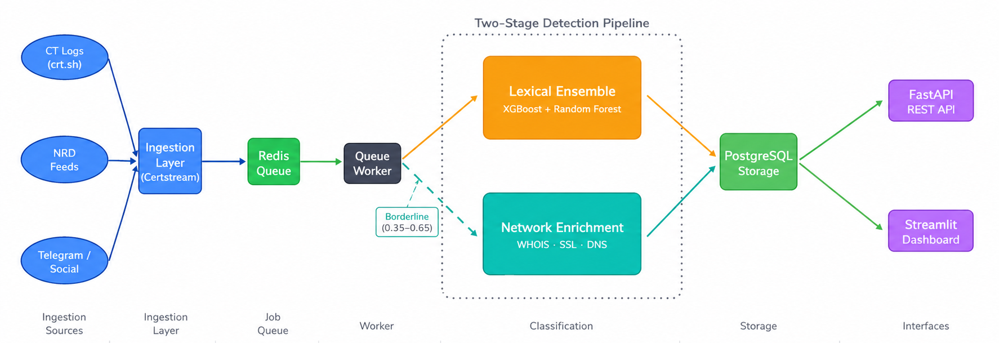

The platform pipeline: CT logs, NRD feeds, and social monitors feed into a Redis-backed ingestion layer. The queue worker applies a lexical ensemble (XGBoost + Random Forest) first. Borderline domains in the `[0.35, 0.65]` confidence range are escalated to network enrichment (WHOIS · SSL · DNS). Results persist to storage and are surfaced via FastAPI and the ops console.

#### ML Decision Flow

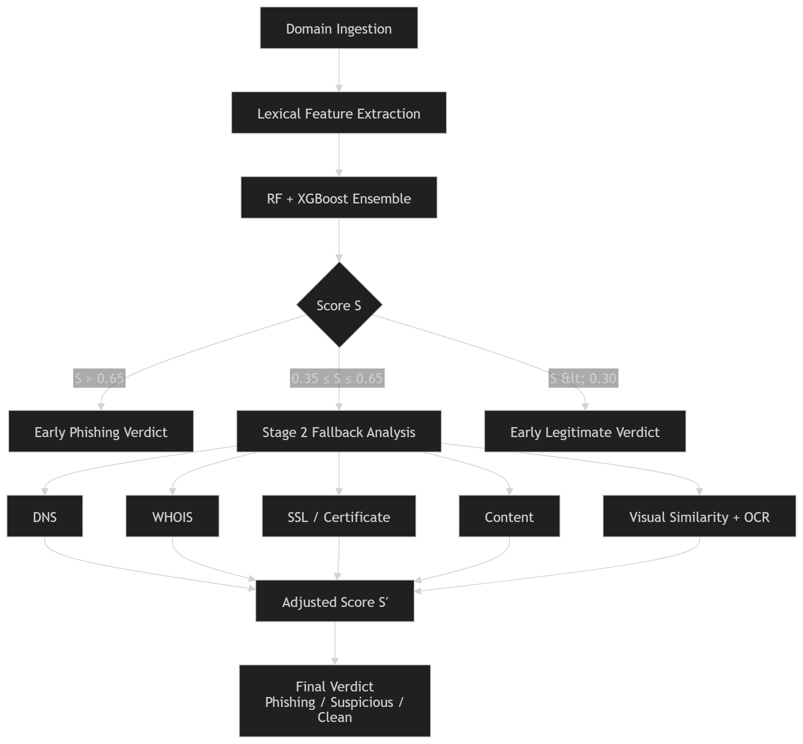

The inference decision tree. Scores above 0.65 exit early as **Phishing**. Scores below 0.30 exit early as **Clean**. Borderline cases enter Stage 2 fallback analysis — DNS, WHOIS, SSL, content features, and visual OCR — producing an adjusted score `S'` and a final three-way verdict.

---

### Ops Console — Platform Mode

#### Main Dashboard — Live Threat Feed

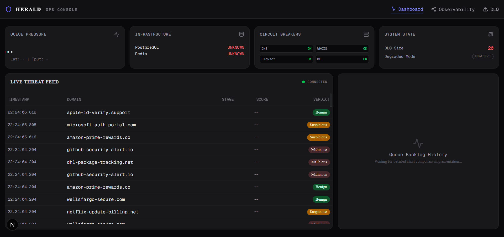

The live threat feed showing real-time domain verdicts (Benign / Suspicious / Malicious), queue pressure, infrastructure state, circuit breaker statuses, and system DLQ size.

#### Observability — Infrastructure & Browser Fleet

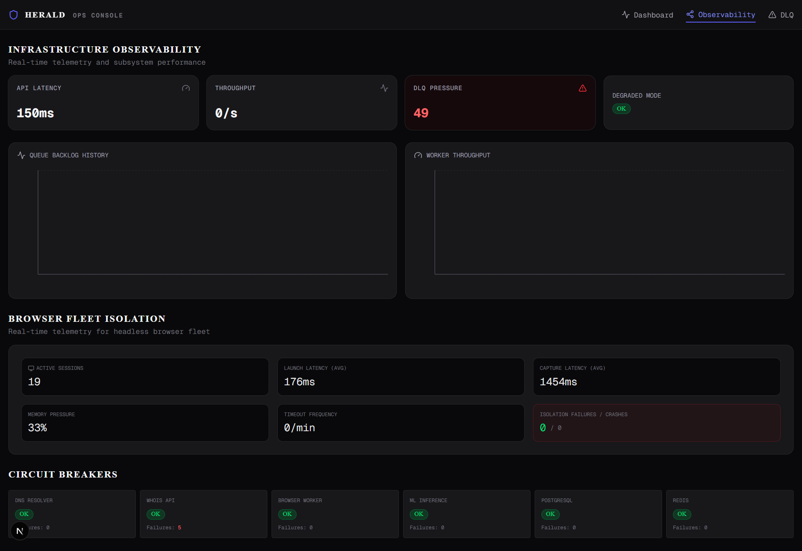

Infrastructure observability view: API latency, worker throughput, DLQ pressure, degraded mode state, queue backlog history chart, browser fleet telemetry (active sessions, launch latency, capture latency, memory pressure), and circuit breaker states for DNS, WHOIS, Browser, ML, PostgreSQL, and Redis subsystems.

#### DLQ — Dead Letter Queue

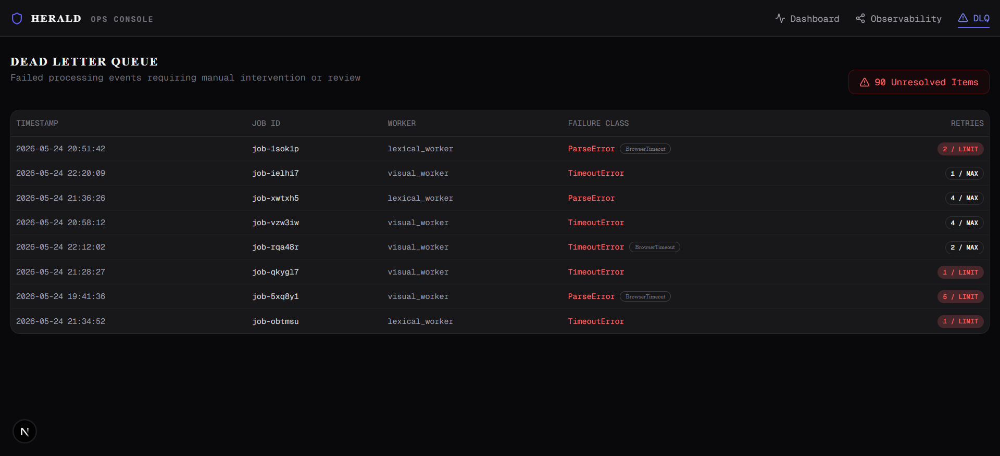

The Dead Letter Queue view listing failed jobs requiring manual intervention — job IDs, worker assignment, failure class (ParseError / TimeoutError), browser timeout tags, and retry counts against limits.

---

### Ops Console — Domain Investigation Detail

#### High-Confidence Phishing — amazon-prime-rewards.co (93.6% CRIT)

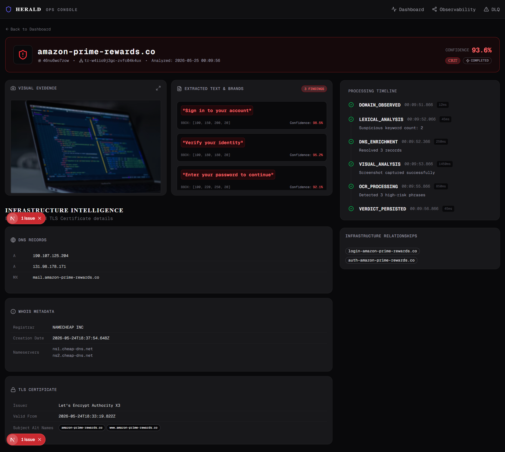

Platform domain detail for a confirmed phishing domain. OCR extracted three high-risk credential phrases ("Sign in to your account", "Verify your identity", "Enter your password to continue") at 98.5%, 95.2%, and 92.1% confidence respectively. Infrastructure relationships show associated `login-` and `auth-` subdomains. Let's Encrypt TLS issuer, Namecheap registrar, created 2026-05-24.

#### Low-Confidence Benign — dropbox-file-access.net (10.0% OK)

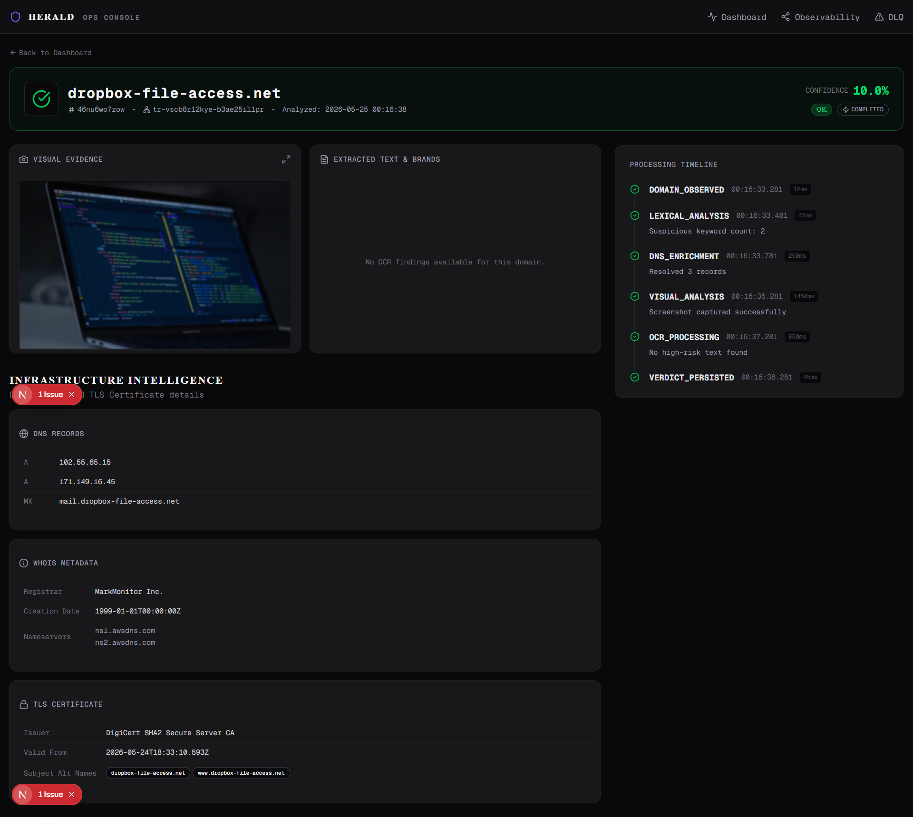

Platform domain detail for a domain that scored clean. No OCR findings, processing timeline shows all stages completed (domain observed → lexical analysis → DNS enrichment → visual analysis → OCR → verdict persisted). DNS resolves to two A records and an MX pointing to the same domain. DigiCert TLS issuer, MarkMonitor registrar, creation date 1999 — signals a legitimate or parked domain.

---

### CLI Investigation Examples

#### SSRF Protection — IIIT Delhi (Internal Network, Blocked)

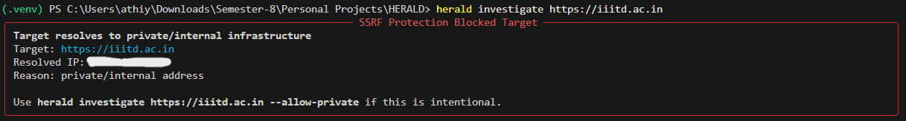

Running `herald investigate https://iiitd.ac.in` while connected to the campus network. The domain resolves to `192.168.2.127` — a private RFC1918 address. HERALD's SSRF guard immediately blocks the target before any browser execution occurs, printing the resolved IP and reason. The `--allow-private` flag is offered as an explicit override for intentional internal analysis.

#### SSRF Override — IIIT Delhi (Internal Network, Allowed)

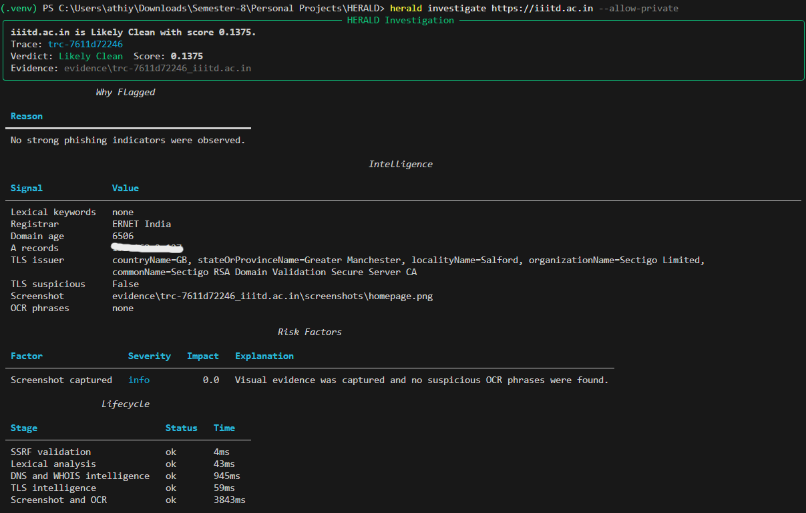

Running `herald investigate https://iiitd.ac.in --allow-private`. With the override flag, the investigation proceeds: lexical analysis (43ms), DNS + WHOIS intelligence (945ms), TLS inspection via Sectigo RSA CA (59ms), and screenshot + OCR (3843ms). Verdict: **Likely Clean**, score 0.1375. Registrar: ERNET India. Domain age: 6506 days. No suspicious OCR phrases found.

#### Legitimate Domain — Paytm

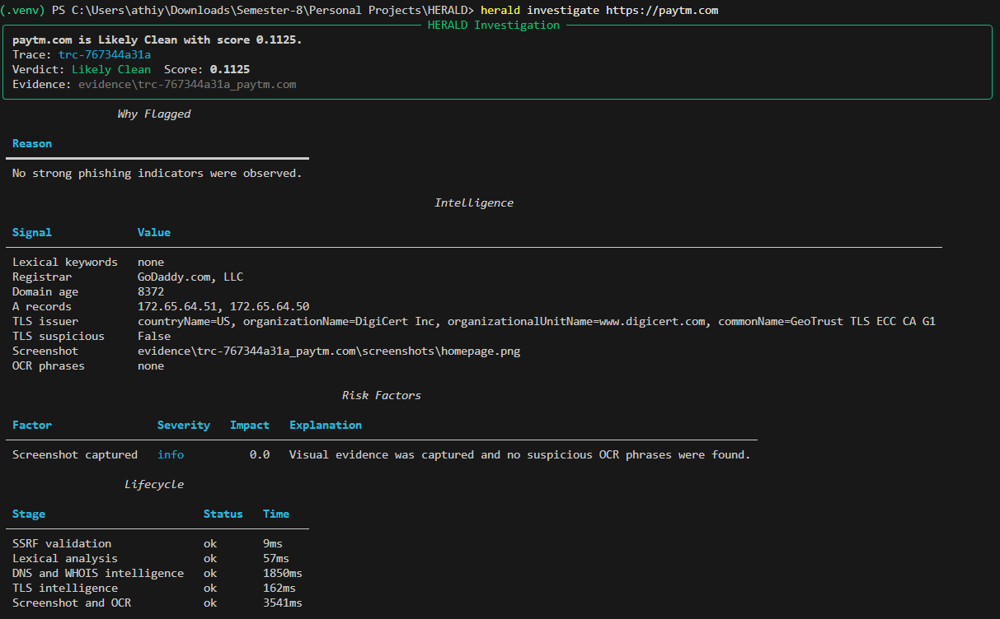

`herald investigate https://paytm.com` — verdict **Likely Clean**, score 0.1125. Registrar: GoDaddy. Domain age: 8372 days. TLS issuer: DigiCert / GeoTrust. No lexical keywords triggered. Screenshot captured with zero suspicious OCR phrases. Full lifecycle: SSRF validation (9ms) → lexical analysis (57ms) → DNS + WHOIS (1850ms) → TLS (162ms) → screenshot + OCR (3541ms).

#### Suspicious Domain — authena.xyz

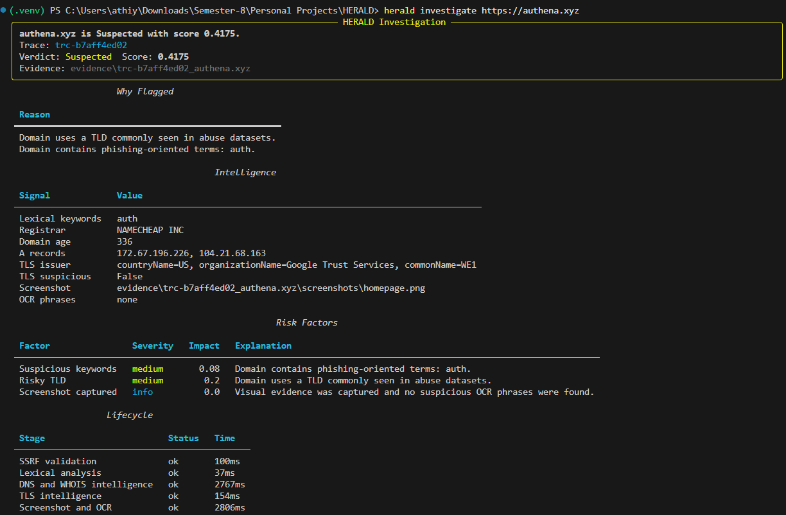

`herald investigate https://authena.xyz` — verdict **Suspected**, score 0.4175. Two risk factors flagged: lexical keyword `auth` (medium severity, impact 0.08) and `.xyz` TLD commonly seen in abuse datasets (medium severity, impact 0.2). Registrar: Namecheap. Domain age: 336 days. TLS issuer: Google Trust Services. Screenshot captured with no OCR phrases, but lexical + TLD signals are sufficient to hold the domain as Suspected. Full lifecycle completed in under 6 seconds.

---

### API Reference

#### Swagger / OpenAPI


Full Swagger UI for the HERALD FastAPI backend, showing all registered routes.

#### API — /api/scan Execution

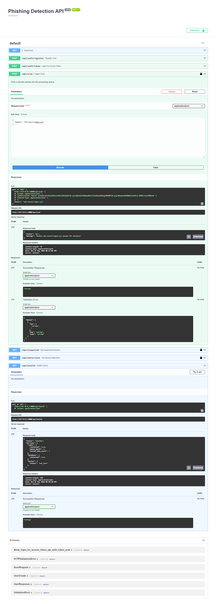

Live `/api/scan` execution in Swagger: POST body `{"domain": "sbi-secure-login.xyz"}`, bearer auth header, server response confirming the domain is queued for analysis. Also shows the `/api/health` liveness response with DB connection state, queue depth, and Redis status.

---

## Technology Stack

| Layer | Technology |
|---|---|
| Backend API | Python · FastAPI · SQLAlchemy · Structlog |
| ML Framework | Scikit-learn · XGBoost · Transformers |
| Queue & Telemetry | Redis (queue, pub/sub, circuit breaker) |
| Browser & OCR | Playwright · Tesseract |
| Database | SQLite (default) · PostgreSQL (optional) |
| Frontend | Next.js · TypeScript · TailwindCSS · shadcn/ui · Recharts |
| Containerization | Docker · Docker Compose |
| Auth | OAuth2 password flow · JWT (bcrypt passwords) |

---

## Deployment

### Clone and install

```bash
git clone https://github.com/Black-Coffee-Ramen/HERALD.git
cd HERALD
pip install -e .
```

### Docker (platform mode)

```bash
cp .env.example .env        # set SECRET_KEY and any overrides
docker compose up --build
python setup_db.py
```

Services started by `docker-compose.yml`:

| Service | Role |
|---|---|
| `redis` | Queue broker · pub/sub · circuit state |
| `api` | FastAPI REST + WebSocket on `:8000` |
| `worker` | Domain scoring worker |
| `visual-worker` | Screenshot/OCR worker (Playwright subprocess) |

The Next.js frontend runs separately (`cd frontend && npm run dev`).

### Key environment variables

| Variable | Default | Notes |
|---|---|---|
| `SECRET_KEY` | dev fallback | **Must be set in production** |
| `DATABASE_URL` | `sqlite:///domain_history.db` | Set to PostgreSQL URI for production |
| `REDIS_HOST` | `redis` | Set in compose automatically |
| `MODEL_PATH` | `models/ensemble_v7.joblib` | Override to use v8/v9 |
| `NEXT_PUBLIC_TELEMETRY_MODE` | `MOCK` | Set `REAL` or `HYBRID` for live backend |

---

## Security Considerations

**Strengths**
- SSRF guard blocks private RFC1918, loopback, and cloud-metadata destinations
- Visual worker container drops all capabilities, runs as non-root, uses PID/tmpfs limits
- OAuth2/JWT protects all data endpoints; passwords hashed with bcrypt
- Queue backpressure prevents resource exhaustion

**Known gaps (to be addressed before production)**
- CORS is `allow_origins=["*"]` with credentials — must be restricted
- Default `SECRET_KEY` fallback must not reach production
- Public `/api/auth/register` endpoint should be gated
- Frontend real-mode API calls currently lack bearer auth plumbing
- Redis has no named volume in active compose — persistence depends on container filesystem
- Joblib model artifacts are trusted pickle; validate provenance before deploying

---

## Repository Structure

```text
.
├── herald/                    # Main Python package
│   ├── api/                   # FastAPI app, routes, auth, WebSocket
│   ├── cli.py                 # CLI entry point
│   ├── investigation/         # Pipeline, scoring, intelligence, persistence
│   ├── features/              # Lexical and content feature extractors
│   ├── monitoring/            # Queue workers, Redis queue, telemetry
│   ├── core/                  # Security, Playwright analyzer, auth
│   ├── db/                    # SQLAlchemy models
│   ├── telemetry/             # Emitter, stream, schemas
│   └── predict_with_fallback.py  # Active runtime predictor (PhishingPredictorV3)
├── frontend/                  # Next.js ops console
├── scripts/                   # Research pipeline (download → build → train → validate)
├── models/                    # Trained model artifacts (v2–v9 joblib + transformer)
├── data/                      # Raw feeds, processed datasets
├── evidence/                  # Live investigation artifacts (trc-* directories)
├── outputs/                   # Experiment results and validation CSVs
├── tests/                     # CLI investigation unit tests
├── docker/                    # Dockerfile + legacy compose
├── docker-compose.yml         # Active compose (use this, not docker/)
└── domain_history.db          # SQLite default (created at runtime)
```

---

## Current Limitations

- Some frontend views remain partially mock-driven (DLQ, trace detail pages)
- Redis queue retry/DLQ behavior has a known bug (`redis_queue.py`) — not safe to rely on in production
- `--reload` flag in compose API command is not appropriate for production
- v8/v9 model artifacts require explicit `MODEL_PATH` configuration; they are not auto-adopted
- Legacy Streamlit dashboard is auth-incompatible with current OAuth2 API routes
- OCR depends on local Tesseract runtime availability

---

## Future Work

- Fix `RedisReliableQueue.retry_or_dlq` and DLQ behavior
- Add Alembic migrations and PostgreSQL service to production compose
- Wire bearer auth into Next.js frontend real-mode API calls
- Add model version configuration via `MODEL_PATH` env var
- Add integration tests for API + worker + Redis failure paths
- OpenTelemetry export and Prometheus/Grafana integration
- Redirect-chain analysis and stronger report visualization
- Consolidate visual paths around Playwright (remove legacy Selenium/EasyOCR fallback)
- Real-time analyst feedback loops for active learning

---

## License

MIT License

Copyright (c) 2026 Athiyo Chakma

## Author

<div align="center">

=======
Permission is hereby granted, free of charge, to any person obtaining a copy
of this software and associated documentation files (the "Software"), to deal
in the Software without restriction, including without limitation the rights
to use, copy, modify, merge, publish, distribute, sublicense, and/or sell
copies of the Software, and to permit persons to whom the Software is
furnished to do so, subject to the following conditions:

The above copyright notice and this permission notice shall be included in all
copies or substantial portions of the Software.

THE SOFTWARE IS PROVIDED "AS IS", WITHOUT WARRANTY OF ANY KIND, EXPRESS OR
IMPLIED, INCLUDING BUT NOT LIMITED TO THE WARRANTIES OF MERCHANTABILITY,
FITNESS FOR A PARTICULAR PURPOSE AND NONINFRINGEMENT. IN NO EVENT SHALL THE
AUTHORS OR COPYRIGHT HOLDERS BE LIABLE FOR ANY CLAIM, DAMAGES OR OTHER
LIABILITY, WHETHER IN AN ACTION OF CONTRACT, TORT OR OTHERWISE, ARISING FROM,
OUT OF OR IN CONNECTION WITH THE SOFTWARE OR THE USE OR OTHER DEALINGS IN THE
SOFTWARE.

## Author

<div align="center">

**Athiyo Chakma**  
CSE Undergraduate · IIIT Delhi  
Mail: athiyo22118@iiitd.ac.in

Built as a phishing investigation, threat-intelligence, and operational security tooling project focused on evidence-first analysis of domains targeting Indian critical infrastructure.

</div>
